# Oriveo — Comprehensive Demo Guide

Complete walkthrough of all features with screenshots.

## Quick Start

### Clinic Demo Account
- **URL:** http://localhost:5173
- **Email:** `anassamiri87@gmail.com`
- **Password:** `demo123`
- **Role:** Organization Admin — "Demo Clinic"

### Super Admin Account
- **URL:** http://localhost:5173
- **Email:** `admin@oriveo.io`
- **Password:** `OriveoAdmin2026!`
- **Role:** Super Admin — full access to all organizations

---

## 🌐 Multi-Tenant Architecture

Oriveo supports multiple independent clinics (organizations). Each clinic:
- Has its own patients, calls, reports, appointments, team members, audit logs
- Cannot see any other clinic's data
- Has its own subscription plan (Starter / Professional / Enterprise)
- Is created automatically during signup


The dashboard shows:
- Total calls (outbound + inbound)
- Patients count
- Reports generated
- Recent activity feed
- Quick-action buttons for common tasks

---

## 🏥 Patient Management

### Patient List
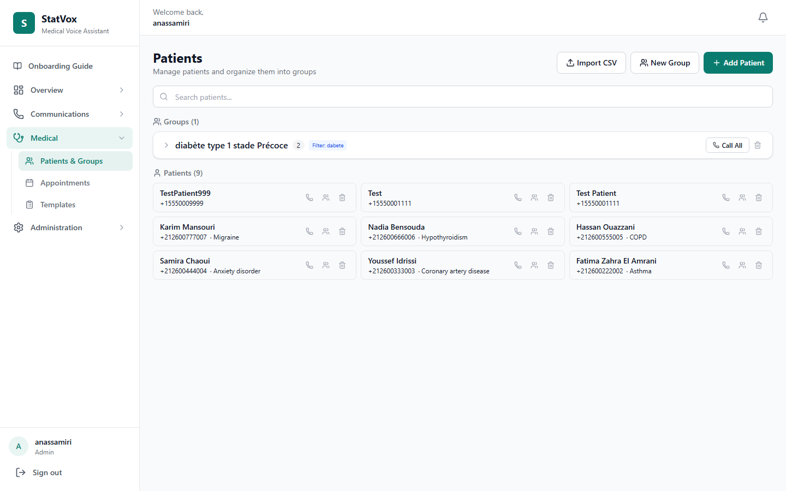

- Search by name, phone, email
- Filter by organization (auto-scoped)
- Add new patients with full PHI fields
- View patient details

### Patient Detail
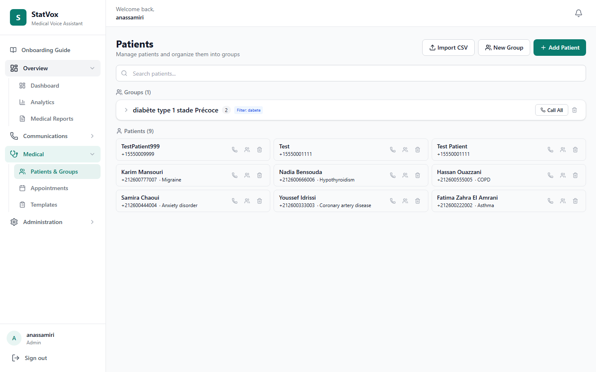

Each patient record includes:
- **Demographics:** Name, DOB, gender, blood type, language
- **Contact:** Phone, email, address
- **Medical:** Primary diagnosis, conditions, allergies, medications, surgeries
- **Insurance:** Provider, policy ID
- **Clinical:** Assigned doctor, emergency contact, AI Knowledge Base notes
- **AI Knowledge Base Notes** — editable field for custom AI context

*Note: PHI fields are encrypted at rest using AES-256-GCM.*

---

## 📞 Call Management (Outbound)

### Call List


- All outbound AI-powered calls
- Filter by status (completed, in-progress, failed, emergency)
- Search by patient name or phone
- Status badges with color coding
- Duration, QA score, and AI summary preview

### Call Detail
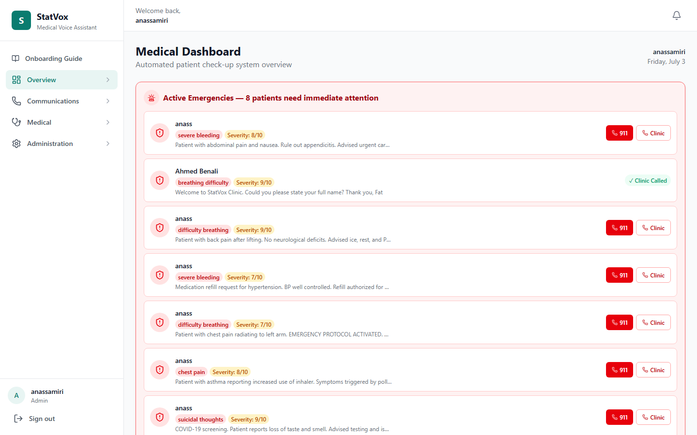

Each call page shows:
- **Call info:** Direction, patient, duration, status, timestamps
- **Transcript:** Full AI-patient conversation with speaker labels
- **AI Summary:** Automated clinical summary generated by GPT-4o-mini
- **Severity Assessment:** AI-scored severity (low/moderate/high/emergency)
- **QA Score:** Quality assessment of the call
- **Audio Recording:** Playback of the call audio
- **Emergency Banner:** Red alert if emergency detected (with 911 and clinic call buttons)
- **PHI Detection:** Flagged sensitive information in transcript

### Emergency Protocol
When AI detects an emergency keyword:
1. Call is flagged with `emergency: true`
2. Red banner appears on Dashboard and Call Detail
3. Notification sent to all clinic staff in real-time
4. 911 dial button available (requires Twilio configuration)
5. Clinic emergency number button

---

## 📱 Inbound Call Handling

### Inbound Calls Page
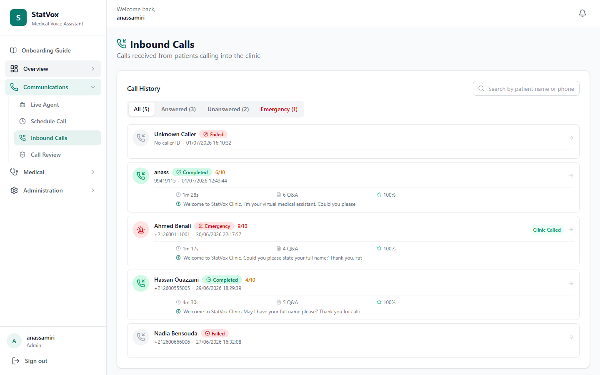

Oriveo handles incoming calls via Twilio webhooks + WebSocket media streams.

**4 Tabs:**
| Tab | Shows |
|-----|-------|
| **All** | All inbound calls |
| **Answered** | Calls where patient was identified — shows name, phone, duration, QA score, AI summary |
| **Unanswered** | Calls where patient couldn't be identified — shows name, phone, time only |
| **Emergency** | Calls flagged as emergency |

**Features:**
- Real-time search by name or phone
- Status badges (completed, in-progress, failed, emergency)
- Click any call to view full Call Detail page

### How Inbound Calls Work
1. Patient calls Twilio phone number
2. Twilio sends webhook to `POST /api/twilio/inbound`
3. Server responds with TwiML containing `<Connect><Stream>` to WebSocket
4. WebSocket handler (`inboundMediaStream.js`) connects to Deepgram (STT) + ElevenLabs (TTS) + OpenAI (AI)
5. **Phase 1 — Identification:** AI greets patient, asks for name, searches Patient DB
6. If patient found → Call record updated with patient + organization, moves to Phase 2
7. **Phase 2 — Triage:** AI asks questionnaire questions, detects emergency keywords
8. On completion → transcript saved, QA scored, summary generated, notification sent
9. If patient not identified → failure message, call hangs up

---

## 📋 Questionnaires


Create and manage AI-powered call questionnaires:
- Pre-built medical templates (e.g., "General Check-up", "Medication Refill")
- Custom questions with various types (yes/no, free text, multiple choice)
- Questions are used by AI during both outbound and inbound calls
- Templates can be assigned to specific call types

---

## 📊 Reports

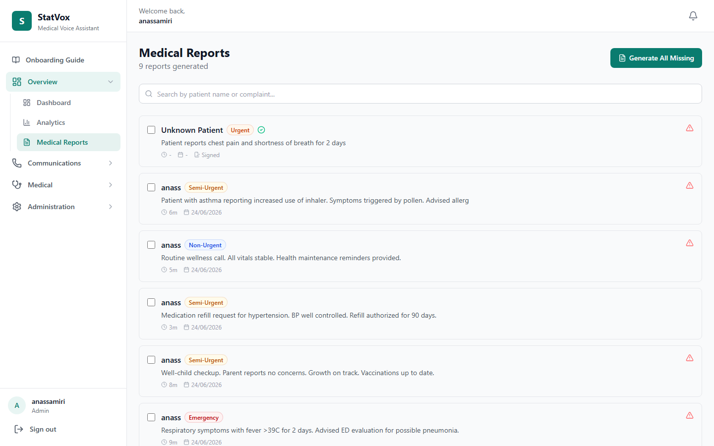

- AI-generated clinical reports from call transcripts
- FHIR R4 export (JSON Bundle format with SNOMED CT codes)
- PDF generation with digital signature support
- Filter by patient, date range, severity
- Download individual reports

### FHIR Export
Each report can be exported as a FHIR R4 Bundle containing:
- `Patient` resource with demographics
- `Encounter` resource for the call
- `ClinicalImpression` with AI assessment
- `Condition` resources for diagnoses
- `Observation` resources for symptoms and vitals
- `MedicationRequest` if applicable

---

## 🧠 Knowledge Base


- Upload custom medical documents
- Documents are used as context by the AI during calls
- Supports text-based medical knowledge
- Per-organization document isolation

---

## 📅 Appointments

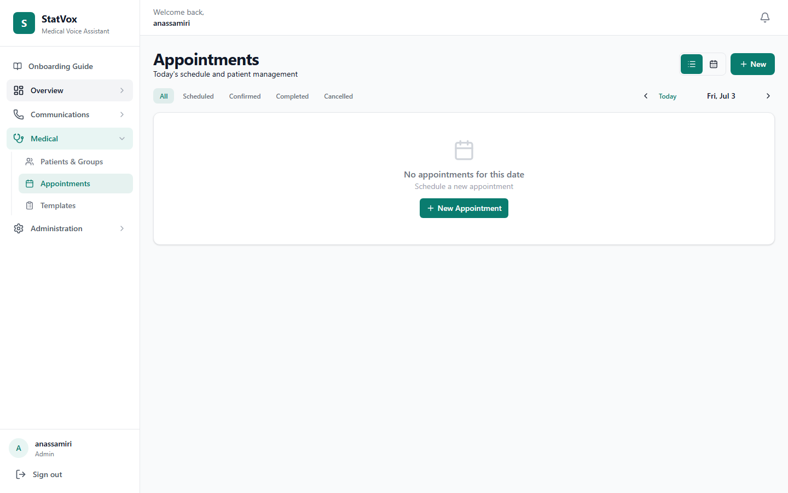

- Schedule and manage patient appointments
- View appointments in a list view
- Status tracking (scheduled, completed, cancelled, no-show)
- Patient name, type, date/time display
- Auto-generated from demo data

---

## 👥 Team Management


- View all team members in your organization
- Add/remove team members
- Role assignment (admin, doctor, nurse, staff)
- Active/inactive status
- Real-time updates

---

## 🔔 Notifications

### Dropdown (Navbar)
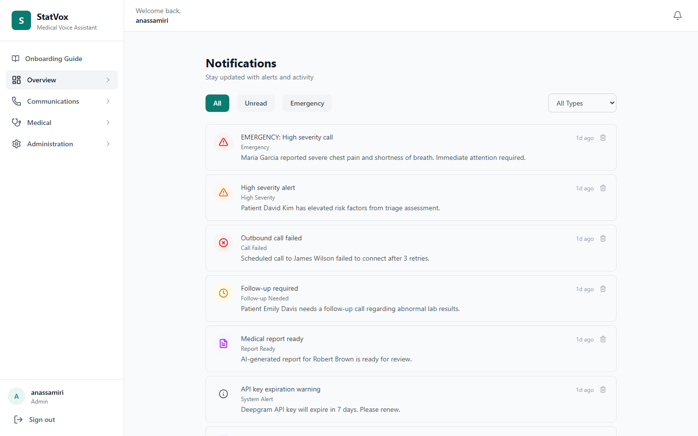

The top navbar bell icon shows:
- **Unread count badge** (real-time updates via WebSocket)
- **Dropdown** with last 5 unread notifications
- Type-specific icons (emergency=red, inbound=blue, etc.)
- Click to mark read + navigate to relevant page
- "Mark all read" button
- "View all notifications" link

### Full Notification Page
- Tabs: All / Unread / Emergency
- Infinite scroll pagination
- Delete individual notifications
- Mark all as read
- Click any notification to navigate to its context

**Notification Types:**
| Type | Trigger |
|------|---------|
| `emergency` | AI detects emergency keyword during call |
| `high_severity` | Call scored as high severity |
| `inbound_received` | New inbound call arrives |
| `inbound_completed` | Inbound call finishes |
| `call_failed` | Call connection fails |
| `report_ready` | AI report generation complete |
| `follow_up_needed` | Call requires follow-up |
| `appointment_reminder` | 24h before appointment |
| `system_alert` | Missing API keys or config |

---

## 📝 Audit Log

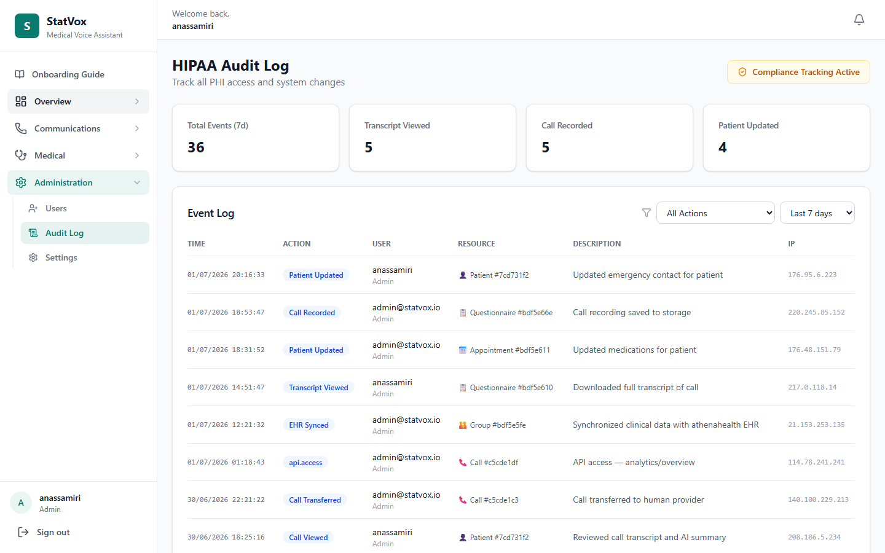

Full audit trail of all actions:
- User logins and logouts
- Patient CRUD operations
- Call events (start, complete, fail)
- Report generation and exports
- Settings changes
- Team management actions
- Filterable by action type and date range

---

## ⚙️ Settings

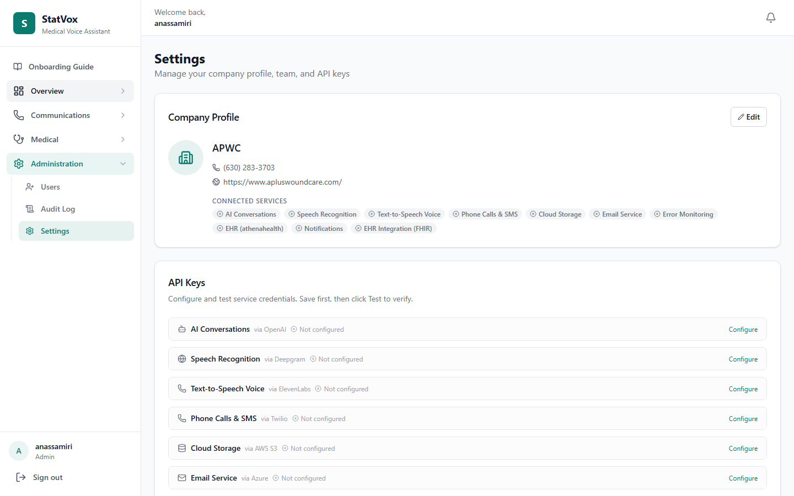

Clinic-level configuration:
- **Organization Profile:** Name, address, phone
- **Subscription:** Current plan, status, features
- **API Keys:** OpenAI, Deepgram, ElevenLabs, Twilio configuration
- **Emergency:** Clinic emergency number
- **Security:** Password policies, session management

---

## 🔐 Super Admin Panel

The super admin panel provides cross-organization management.

### Admin Dashboard
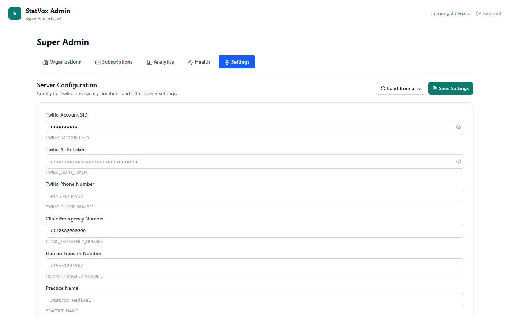

- Total organizations, users, calls across the entire platform
- System health monitoring
- Revenue/subscription analytics
- Recent platform-wide activity

### Organization Management


- View all registered clinics
- Manage subscriptions (plan type, status, features)
- Activate/deactivate organizations
- View per-organization usage metrics

### Server Settings
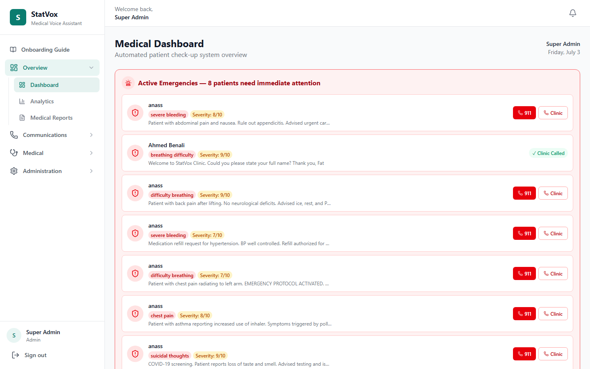

- Platform-wide configuration
- API key management (masked display)
- Feature flags
- Security settings

### Activity Monitoring


- Real-time platform-wide audit log
- Filter by organization, user, action type
- System health alerts

---

## 🏗️ Architecture Overview

```
┌─────────────────────────────────────────────────────────┐
│                    Client (Vite + React)                 │
│  Dashboard │ Patients │ Calls │ Reports │ Admin Panel   │
├─────────────────────────────────────────────────────────┤
│              Vite Proxy (port 5173)                      │
│         /api → localhost:5000  /socket.io → WS           │
├─────────────────────────────────────────────────────────┤
│                Server (Express, port 5000)               │
│  ┌───────┐ ┌──────────┐ ┌────────────┐ ┌─────────────┐ │
│  │ Auth  │ │ Calls    │ │ AI Service │ │ Notifications│ │
│  │Routes │ │(WS/HTTP) │ │(GPT-4o)   │ │ (Socket.IO)  │ │
│  └───────┘ └──────────┘ └────────────┘ └─────────────┘ │
│  ┌───────┐ ┌──────────┐ ┌────────────┐ ┌─────────────┐ │
│  │Patients│ │Inbound   │ │ FHIR       │ │ Admin       │ │
│  │Routes  │ │(TwilioWS)│ │ Converter  │ │ Routes      │ │
│  └───────┘ └──────────┘ └────────────┘ └─────────────┘ │
├─────────────────────────────────────────────────────────┤
│             External Services                           │
│  OpenAI    Deepgram    ElevenLabs    Twilio   MongoDB   │
│  (GPT-4o)  (STT)      (TTS)        (Phone)  (DB)      │
└─────────────────────────────────────────────────────────┘
```

### Data Flow — Outbound Call
1. Dashboard → `POST /api/calls` → creates Call in MongoDB
2. Server connects to Deepgram (speech-to-text) + ElevenLabs (TTS)
3. Server sends patient context + questionnaire to OpenAI
4. AI converses with patient via WebSocket media stream
5. Transcript streamed in real-time to frontend via Socket.IO
6. On completion: QA scoring, summary generation, report creation
7. Notification sent to clinic staff

### Data Flow — Inbound Call
1. Patient calls Twilio number → Twilio webhook to `/api/twilio/inbound`
2. Server responds with TwiML → WebSocket connection established
3. Two-phase AI flow: Identification → Triage
4. Call record created with direction="inbound"
5. If patient found → full triage flow with transcript + QA + summary
6. Emergency detection and notification same as outbound

---

## 🛡️ Security Features

| Feature | Implementation |
|---------|---------------|
| **Multi-tenant isolation** | `organization` field on every model; `tenantFilter` middleware auto-applies |
| **Super admin bypass** | `superAdmin: true` users bypass all tenant filters |
| **PHI encryption at rest** | AES-256-GCM on 14 patient fields |
| **JWT with token version** | Session revocation capability via `tokenVersion` |
| **Password hashing** | bcrypt with 12 salt rounds |
| **Subscription enforcement** | `requireActiveSubscription` middleware on all protected routes |
| **Audit logging** | Every CRUD + auth action logged with user, IP, timestamp |
| **Real-time notifications** | Socket.IO with per-user rooms (`user:${userId}`) |

---

## 🚀 Deployment

### Prerequisites
- Node.js 20+
- MongoDB 7+
- External API keys: OpenAI, Deepgram, ElevenLabs, Twilio

### Quick Start
```bash
git clone <repo>
cd oriveo
cp .env.example .env   # Configure API keys + MongoDB URI
cd server && npm install && cd ../client && npm install && cd ..
docker-compose up -d    # Or manually start MongoDB + app
```

### Environment Variables
| Variable | Description |
|----------|-------------|
| `MONGODB_URI` | MongoDB connection string |
| `JWT_SECRET` | JWT signing secret |
| `PHI_ENCRYPTION_KEY` | 64 hex chars for AES-256-GCM |
| `OPENAI_API_KEY` | OpenAI API key |
| `DEEPGRAM_API_KEY` | Deepgram API key |
| `ELEVENLABS_API_KEY` | ElevenLabs API key |
| `TWILIO_ACCOUNT_SID` | Twilio account SID |
| `TWILIO_AUTH_TOKEN` | Twilio auth token |
| `TWILIO_PHONE_NUMBER` | Twilio phone number |
| `CLINIC_EMERGENCY_NUMBER` | Default emergency number |

---

## 📋 API Endpoints Summary

| Method | Path | Description |
|--------|------|-------------|
| `POST` | `/api/auth/login` | Login |
| `POST` | `/api/auth/signup` | Signup (creates org) |
| `GET` | `/api/patients` | List patients |
| `POST` | `/api/patients` | Create patient |
| `GET` | `/api/patients/:id` | Get patient |
| `PUT` | `/api/patients/:id` | Update patient |
| `DELETE` | `/api/patients/:id` | Delete patient |
| `GET` | `/api/calls` | List calls (?direction=inbound) |
| `POST` | `/api/calls` | Start outbound call |
| `GET` | `/api/calls/:id` | Get call detail |
| `GET` | `/api/reports` | List reports |
| `GET` | `/api/reports/:id/fhir` | FHIR export |
| `GET` | `/api/reports/:id/pdf` | PDF download |
| `GET` | `/api/questionnaires` | List questionnaires |
| `POST` | `/api/questionnaires` | Create questionnaire |
| `GET` | `/api/appointments` | List appointments |
| `GET` | `/api/notifications` | List notifications |
| `PUT` | `/api/notifications/:id/read` | Mark read |
| `PUT` | `/api/notifications/read-all` | Mark all read |
| `POST` | `/api/twilio/inbound` | Twilio inbound webhook |
| `GET` | `/api/team` | List team members |
| `DELETE` | `/api/team/:id` | Remove team member |
| `GET` | `/api/audit/logs` | Audit log |
| `GET` | `/api/admin/*` | Super admin endpoints |

---

## Demo Data Seeded

The `seedFullDemo.mjs` script creates a complete demo environment:

- **7 Patients** with full medical records (diagnoses, conditions, allergies, medications, surgeries, insurance, emergency contacts)
- **17 Outbound calls** with transcripts, AI summaries, severity scores, QA assessments
- **5 Inbound calls** (3 answered with full data, 2 unanswered/unidentified)
- **9 Clinical reports** with FHIR-ready data
- **8 Appointments** across multiple statuses
- **200+ Audit log entries** covering all action types
- **9 Notifications** of various types (emergency, inbound, call_failed, etc.)

---

## Next Steps

1. **Wire EHR write-back** — Connect call completion to athenahealth (detailed below)
2. **Patient Detail edit mode** — Make patient info fields editable inline
3. **Protect super admin from deactivation** — Ensure subscription middleware skips super admins
4. **No-code agent builder** — Drag-and-drop questionnaire + AI behavior configuration
5. **Test inbound calls** — Use ngrok to expose local server for Twilio webhook testing
6. **Deploy with Docker** — SSL cert volumes for production HTTPS
7. **HIPAA BAAs** — Business Associate Agreements with OpenAI, Deepgram, ElevenLabs, Twilio

---

## 🔌 EHR Write-Back (athenahealth)

### What It Does
After an AI call completes, Oriveo can automatically write the clinical summary back to the patient's EHR (Electronic Health Record) in athenahealth.

### How It Works

```
Call completes → AI summary generated → Write clinical note to athenahealth

1. Call flow reaches markCallCompleted()
2. If patient has athenahealth patient ID → trigger writeClinicalNote()
3. Service obtains athenahealth OAuth2 token
4. POST /v1/{practiceId}/patients/{patientId}/documents
5. Document contains: AI summary + transcript + severity + recommendations
6. On success → log to audit trail
7. On failure → create notification for clinic staff
```

### Current Status
- `server/services/athenaClient.js` — OAuth2 token management is implemented
- `writeClinicalNote()` — needs to be implemented
- Call flow integration point — after `markCallCompleted()` in both `mediaStream.js` and `inboundMediaStream.js`

### What Needs Work
1. Add `athenaPatientId` and `athenaPracticeId` fields to Patient model
2. Implement `writeClinicalNote(callDoc)` in `athenaClient.js`
3. Call it from `mediaStream.js` and `inboundMediaStream.js` after completion
4. Handle failures gracefully (queue for retry, notify staff)

### Integration Flow
```
┌─────────────┐    ┌──────────────┐    ┌──────────────┐
│ Call        │───>│ athenaClient │───>│ athenahealth │
│ Completes   │    │ .writeNote() │    │ EHR API      │
└─────────────┘    └──────────────┘    └──────────────┘
                          │
                          v
                   ┌──────────────┐
                   │ Audit Log +  │
                   │ Notification │
                   └──────────────┘
```

### Required Configuration
| Variable | Description |
|----------|-------------|
| `ATHENA_CLIENT_ID` | athenahealth API client ID |
| `ATHENA_CLIENT_SECRET` | athenahealth API client secret |
| `ATHENA_PRACTICE_ID` | Default practice ID |

athenahealth Marketplace certification takes 10–22 weeks, but direct per-practice integration is possible without certification.
